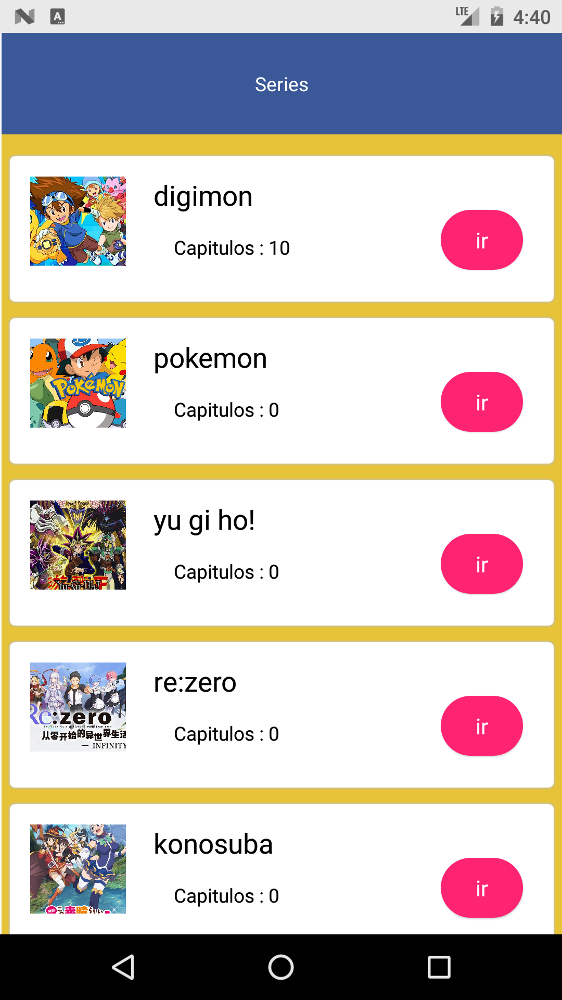
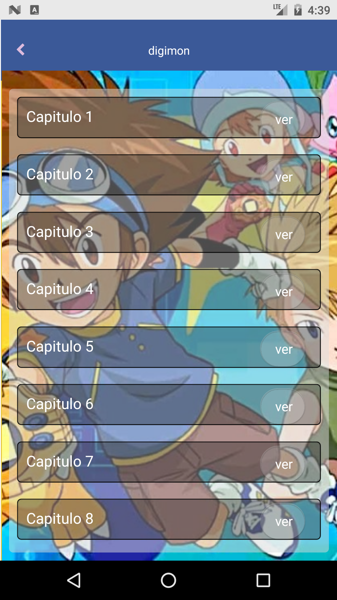

## series anime y mas

### Ejecutar
     yarn android
     yarn start
    
#### compatible con api android 24 y superior.

## Capturas pantalla 

## Series

## Capitulos

## Reproductor

## compilar para android:
    
- entrar en carpeta android: <code> cd /android</code> 
-  ejecutar :
<code> ./gradlew bundleRelease </code> 

para instalar release :
<code>yarn install:android</code>

### nota
tener conectado dispositivo android. 
