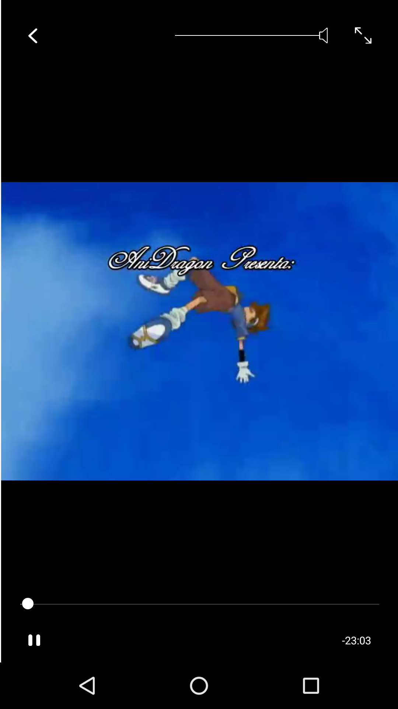
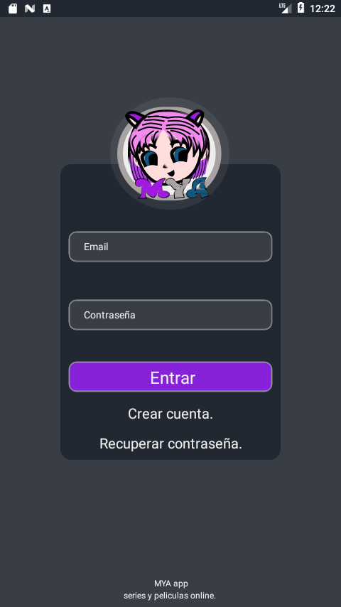

## series anime y mas

### Ejecutar
     yarn android
     yarn start
    
#### compatible con api android 24 y superior.

## Capturas pantalla V1

## Series

## Capitulos

## Reproductor

## Capturas pantalla V2

## Series

## Capitulos

## Busqueda

## Reproductor

# flujo login

## Login

## Crear cuenta 

## Recuperar contraseña 

## Pantalla exito 

## compilar para android:

para instalar release :
<code>yarn install:android</code>

### nota
tener conectado dispositivo android. 

